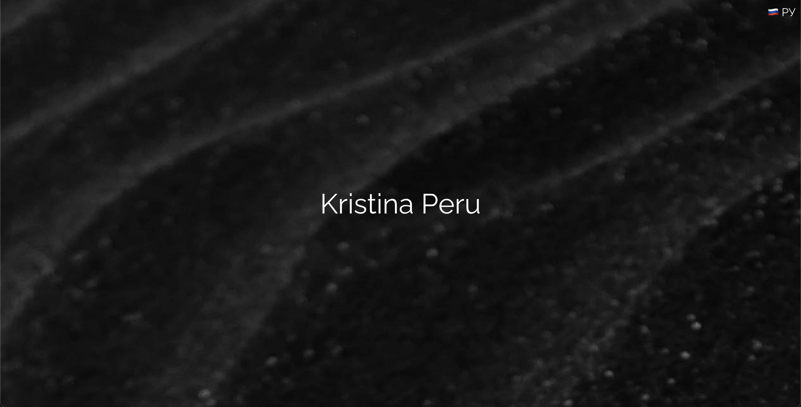

# Peru Portfolio

[Peru Portfolio](https://beforeidieapp.herokuapp.com/)

My portfolio website.

# Setup

The front-end of the website is built using React.

`npm start --prefix client` runs the app in the development mode.

Open [http://localhost:4000](http://localhost:4000) to view it in the browser.

## User Stories
* See My Portfolio
* Toggle Language Between English and Russian
* See my Projects

## What I Used

* [React](https://github.com/facebook/create-react-app)
* [React Reveal](https://github.com/rnosov/react-reveal)
* [React Scroll](https://github.com/1000ship/react-scroll-motion)

## Author

Kristina Peru | [GitHub](https://github.com/krisperu) | [LinkedIn](https://www.linkedin.com/in/kristina-peru-205557189/)
